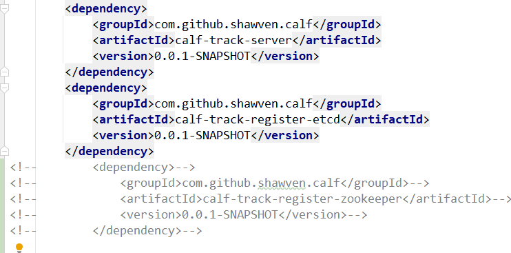
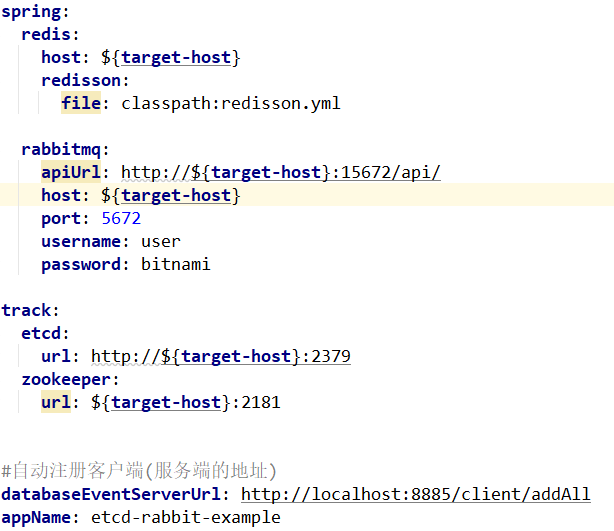

MongodbOpLog

高可用：多节点主备高可用，基于etcd、zookeeper领导选举
数据发布：rabbitmq，kafka（正在支持当中）
命名空间：数据环境应用隔离
可扩充多数据源：mongo、mysql（暂未支持）

track-web，dashboard 基于vuejs，可视化监控操作

**Server**

引入jar包，支持多注册中心



配置properties



**Client**

_例如：监听test表的t_user库 增删改事件
```java
@Service
public class ExampleHandlers {

    private static final Logger logger = LoggerFactory.getLogger(ExampleHandlers.class);

    @DataSubscriber(
            name = "default",
            database = "test",
            table = "t_user",
            actions = {EventAction.INSERT, EventAction.UPDATE, EventAction.DELETE})
    public void handle2(String data) {
        logger.info("接收信息:" + data);
    }
}
```

docker desktop启依赖服务快速体验
